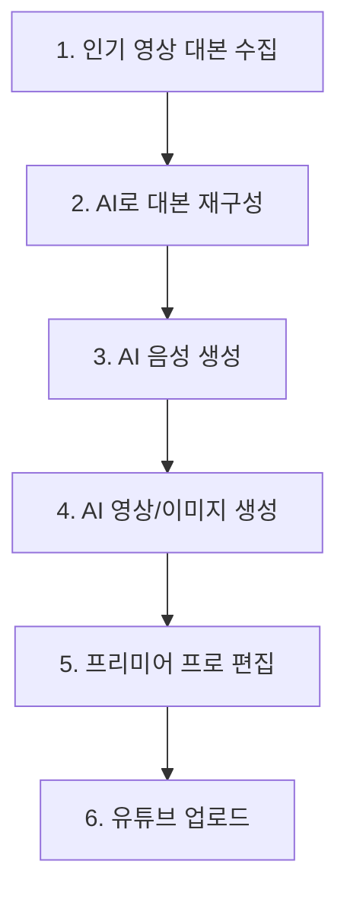

# AI 유튜브 영상 제작 파이프라인 가이드

## 개요

AI 도구들을 활용하여 유튜브 영상을 효율적으로 제작하고, 최종 편집은 프리미어 프로에서 진행하는 워크플로우입니다.

---

## 📋 전체 워크플로우 순서



---

## 🔧 단계별 필요 도구 및 역할

### 1단계: 인기 영상 대본 수집 (스크립트 추출)

| 도구 | 용도 | 비용 |
|------|------|------|
| **YouTube 자체 기능** | 영상 하단 "자막 표시" → 스크립트 복사 | 무료 |
| **NoteGPT** | URL 입력 → 자동 트랜스크립트 + 요약 | 무료/유료 |
| **Tactiq.io** | 유튜브 URL → TXT 다운로드 | 무료 |
| **vidIQ** | 인기 키워드 분석 + 경쟁 분석 | 월 $7.50~ |

> [!TIP]
> NoteGPT(notegpt.io)가 한국어 지원이 가장 좋고, 자동 요약 기능까지 제공합니다.

---

### 2단계: AI로 대본 재구성 (스크립트 생성)

| 도구 | 특징 | 비용 |
|------|------|------|
| **Gemini (Google)** | 무료, 한국어 우수, 긴 컨텍스트 | 무료 |
| **ChatGPT** | 범용, 플러그인 지원 | 무료/유료 |
| **vidIQ AI** | 유튜브 특화 스크립트 생성 | 월 $16.58~ |
| **Poppy AI** | 유튜브 전용, 브랜드 보이스 반영 | 유료 |
| **TubeMagic** | 키워드 최적화 + 바이럴 분석 | 유료 |

> [!IMPORTANT]
> **Gemini를 메인으로 사용**하고, 필요시 vidIQ로 SEO 최적화를 보완하세요.

---

### 3단계: AI 음성 생성 (TTS)

| 도구 | 한국어 지원 | 특징 | 비용 |
|------|-------------|------|------|
| **ElevenLabs** | ✅ 지원 | 가장 자연스러운 음성, 감정 표현 | 무료(10분)/월 $5~ |
| **Murf AI** | ✅ 지원 | 33개 언어, 피치/속도 조절 | 월 $19~ |
| **VEED.io** | ✅ 지원 | 영상 편집 + TTS 통합 | 무료/유료 |
| **Naver Clova** | ✅ 한국어 최적화 | 네이버 API | API 과금 |

> [!TIP]
> **ElevenLabs** 추천 - 가장 자연스럽고 한국어 감정 표현이 뛰어납니다.

---

### 4단계: AI 영상/이미지 생성

#### 텍스트 → 영상 변환 도구

| 도구 | 특징 | 용도 | 비용 |
|------|------|------|------|
| **Pictory** | 스크립트 → 영상, 1000만개 스톡 | 긴 콘텐츠, 페이스리스 | 월 $23~ |
| **InVideo AI** | 5000+ 템플릿, 가성비 좋음 | 쇼츠, 빠른 제작 | 월 $15~ |
| **Synthesia** | AI 아바타, 150+ 캐릭터 | 교육/설명 영상 | 월 $30~ |
| **Runway** | 고급 AI 생성, 영상 효과 | 크리에이티브 콘텐츠 | 월 $15~ |
| **Google Veo** | 구글 AI 영상 생성 | 텍스트→영상 | 베타 |

#### 이미지 생성 도구

| 도구 | 특징 | 비용 |
|------|------|------|
| **Midjourney** | 최고 품질 이미지 | 월 $10~ |
| **DALL-E 3** | ChatGPT 통합 | ChatGPT Plus 포함 |
| **Stable Diffusion** | 로컬 실행 가능, 무료 | 무료 |
| **Canva AI** | 썸네일 제작에 최적 | 무료/유료 |

---

### 5단계: 자동화 플랫폼 (워크플로우 연결)

> [!NOTE]
> 말씀하신 "여러 프로그램을 연결해주는 웹사이트"가 바로 이 자동화 플랫폼들입니다!

| 플랫폼 | 특징 | 난이도 | 비용 |
|--------|------|--------|------|
| **n8n** | 완전 자동화 가능, 유튜브 API 통합 | 중급 | 무료(셀프호스팅)/유료 |
| **Zapier** | 쉬운 연동, 1000+ 앱 지원 | 초급 | 무료/월 $20~ |
| **Make (Integromat)** | 복잡한 워크플로우, 시각적 | 중급 | 무료/월 $9~ |

#### n8n 워크플로우 예시
```
Google Sheet(아이디어) → AI 스크립트 생성 → 이미지 생성 → 
영상 클립 생성 → 음성 생성 → 영상 조합 → YouTube 업로드
```

---

## 👥 역할 배분 (인수인계)

### 역할 1: 콘텐츠 기획자 (Content Planner)
- **담당**: 인기 영상 분석, 주제 선정, 키워드 리서치
- **사용 도구**: vidIQ, NoteGPT, YouTube Analytics
- **산출물**: 영상 주제 기획서, 레퍼런스 대본

#### 🛠️ 개발된 도구: YouTube 인기 영상 분석기
- **위치**: `youtube/content_planner/`
- **기능**: 키워드 검색 → 조회수/좋아요/댓글 기반 품질 점수 계산 → Top 10 영상 추출
- **실행 방법**:
  ```bash
  cd youtube/content_planner
  # .env 파일에 YOUTUBE_API_KEY 설정
  uvicorn main:app --reload
  # 브라우저에서 http://localhost:8000 접속
  ```
- **품질 점수 알고리즘**: 조회수(40%) + 좋아요비율(25%) + 댓글참여율(20%) + 최신성(15%)

### 역할 2: 스크립트 작성자 (Script Writer)  
- **담당**: AI를 활용한 대본 재구성 및 최적화
- **사용 도구**: Gemini, ChatGPT, vidIQ AI
- **산출물**: 최종 대본 (영상용 스크립트)

#### 🛠️ 개발된 도구: AI 스크립트 재구성기
- **위치**: `youtube/content_planner/` (기존 도구에 통합)
- **기능**: 추출된 스크립트 → AI가 스타일/길이 조절하여 새 대본 생성
- **LLM 지원**: Gemini (기본), Claude (향후 전환 가능)
- **실행 방법**:
  ```bash
  cd youtube/content_planner
  # .env 파일에 GEMINI_API_KEY 추가
  GEMINI_API_KEY=your_key_here
  uvicorn main:app --reload
  ```
- **사용법**: 영상 스크립트 추출 → "✨ AI로 재구성" 버튼 클릭
- **옵션**:
  - 스타일: 정보형, 엔터테인먼트형, 교육형, 대화형
  - 길이: 짧게(-30%), 비슷하게, 길게(+30%)

> [!NOTE]
> **LLM 전환 구조**: `providers/` 폴더에 추상화 레이어 구현
> - `base.py`: LLMProvider 인터페이스
> - `gemini.py`: Gemini API 구현 (현재 사용)
> - `claude.py`: Claude API 스텁 (향후 구현)

### 역할 3: 미디어 프로듀서 (Media Producer)
- **담당**: AI 음성 생성, AI 영상/이미지 생성
- **사용 도구**: ElevenLabs, Pictory/InVideo, Midjourney
- **산출물**: 음성 파일(.mp3), 영상 클립(.mp4), 이미지 파일

### 역할 4: 영상 편집자 (Video Editor) 
- **담당**: 프리미어 프로로 최종 편집, 썸네일 제작
- **사용 도구**: Adobe Premiere Pro, Canva
- **산출물**: 최종 영상 파일, 썸네일

### 역할 5: 자동화 엔지니어 (Automation Engineer)
- **담당**: n8n/Zapier로 워크플로우 자동화 구축
- **사용 도구**: n8n, Zapier, Make
- **산출물**: 자동화 파이프라인

---

## 🚀 권장 시작 셋업 (비용 효율적)

### 무료/저비용 시작 패키지

| 단계 | 도구 | 비용 |
|------|------|------|
| 대본 수집 | YouTube 자막 + NoteGPT | 무료 |
| 대본 재구성 | Gemini | 무료 |
| 음성 생성 | ElevenLabs (10분 무료) | 무료 |
| 영상 생성 | InVideo AI | 월 $15 |
| 이미지 | Canva AI | 무료 |
| 편집 | Premiere Pro | 기존 보유 |

**월 예상 비용: ~$15**

---

### 프로 패키지

| 단계 | 도구 | 비용 |
|------|------|------|
| 대본 수집 + SEO | vidIQ Pro | 월 $16 |
| 대본 재구성 | Gemini + ChatGPT Plus | 월 $20 |
| 음성 생성 | ElevenLabs Starter | 월 $5 |
| 영상 생성 | Pictory Professional | 월 $47 |
| 이미지 | Midjourney | 월 $10 |
| 자동화 | n8n (셀프호스팅) | 무료 |

**월 예상 비용: ~$98**

---

## 📁 폴더 구조 제안

```
youtube/
├── 01_기획/
│   ├── 레퍼런스_대본/
│   └── 주제_기획서/
├── 02_스크립트/
│   ├── 원본_스크립트/
│   └── 최종_스크립트/
├── 03_음성/
│   └── TTS_파일/
├── 04_영상소스/
│   ├── AI_영상/
│   └── AI_이미지/
├── 05_프리미어_프로젝트/
│   └── [영상별 폴더]/
└── 06_최종본/
    ├── 영상/
    └── 썸네일/
```

---

## 📌 다음 단계

1. [ ] 무료 도구 계정 생성 (Gemini, NoteGPT, ElevenLabs, Canva)
2. [ ] 테스트 영상 1개 제작 워크플로우 실습
3. [ ] n8n 자동화 파이프라인 구축 검토
4. [ ] 비용 대비 효과 분석 후 유료 도구 결정

---

*문서 작성일: 2026-02-02*
